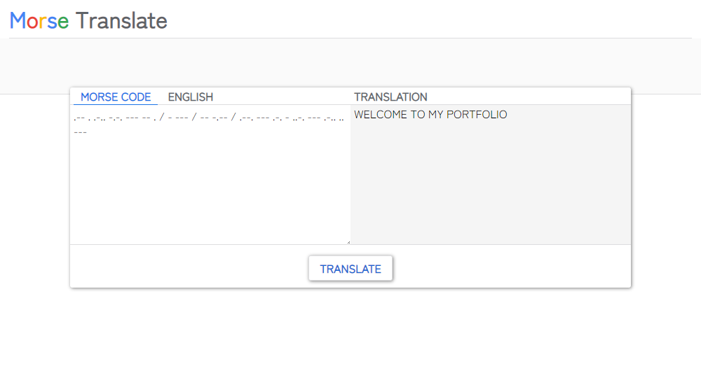

 
# Morse Code Translator
A translator to go from Morse Code -> English or English -> Morse Code. Styling was chosen to mimic Google Translate.

## General Info 
I made this during my software development course at _nology. 
This translator uses imported functions which have been Unit Tested with Jest.

## Technologies used
* Javascript ES6
* HTML 5
* CSS 3
* Unit Testing with Jest

## What can it do
This translator can translate between the following languages:
* Morse Code to English
* English to Morse Code

## Under the Hood
This project's intention was to showcase importing functions and fully Unit Testing them with Jest. 

The project contains 2 Javascript files. app.js is used primary for querySelecting elements on the page and toggling between active classes when selecting whether you want to translate to English or Morse Code.

The translation is done by the translateInput function imported from the translator.js file.

````javascript
const dictionaryArray = [
    ["A", ".-"],["B", "-..."],["C", "-.-."],
    ["D", "-.."],["E", "."],["F", "..-."],
    ["G", "--."],["H", "...."],["I", ".."],
    ["J", ".---"],["K", "-.-"],["L", ".-.."],
    ["M", "--"],["N", "-."],["O", "---"],
    ["P", ".--."],["Q", "--.-"],["R", ".-."],
    ["S", "..."],["T", "-"],["U", "..-"],
    ["V", "...-"],["W", ".--"],["X", "-..-"],
    ["Y", "-.--"],["Z", "--.."],["1", ".----"],
    ["2", "..---"],["3", "...--"],["4", "....-"],
    ["5", "....."],["6", "-...."],["7", "--..."],
    ["8", "---.."],["9", "----."],["0", "-----"],
    [" ", "/"]
  ]

  if (morseCodeHeading.classList.contains("morse-active")) {

    const arrayOfStrings = morseEnglishInput.split(" ");

    for (let index = 0; index < arrayOfStrings.length; index++) {
      for (let j = 0; j < dictionaryArray.length; j++) {
        if (arrayOfStrings[index] == dictionaryArray[j][1]) {
          answer = answer.concat(dictionaryArray[j][0])
        }
      }
    }

    return answer;
  } 

  if (englishHeading.classList.contains("english-active")) {

    const arrayOfStrings = morseEnglishInput.toUpperCase().split("");

    for (let index = 0; index < arrayOfStrings.length; index++) {
      for (let j = 0; j < dictionaryArray.length; j++) {
        if (arrayOfStrings[index] == dictionaryArray[j][0]) {
          answer = answer.concat(dictionaryArray[j][1])
          answer = answer.concat(" ")
        }
      }
    }

    return answer;
  } 
}
;
````

The translations to Morse Code for each letter in the English alphabet is stored in a 2D array. Then depending on whether Morse Code or English is selected, an if statement will run and loop through what you are trying to translate.
If English input is selected, the input is .split() by "" and the input is converted to all uppercase to match the 2D array dictionary. This prevents the input from being case sensitive.
If Morse Code input is selected, the .split() is done wherever there is a Space because that is where each Engligh letter finishes and the next letter begins. Once split, you have the all the translations of each letter split stored in an array which can be looped over and match the correct letter translations. When the matching translation for each index in the array is found, the letter is added to a newly created variable which stores the final translation of the entire input.  

The translateInput fnction being imported is Unit Tested using Jest. Below is a sample test done to ensure a string of English letters translates correctly. 
````
test("it should translate .... --- .-- / .- .-. . / -.-- --- ..- to how are you", () => {
  //Arrange
  let translation;
  const outcome = "HOW ARE YOU";
  //Act
  translation = translateInput(".... --- .-- / .- .-. . / -.-- --- ..-");
  //Assert
  expect(translation).toBe(outcome);
})
````


## I hope you enjoyed my solution to coding this translator. It can be done without using a 2D array, but I chose to do it this way to keep the code as DRY as possible and keep it short. Thanks for visiting my Github!
